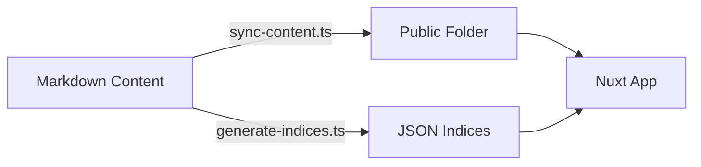

# Project Architecture

> [!NOTE]
> **Goal**: This tutorial explains the high-level design of the Markdown CMS. You will understand why we separated the "Content" from the "Renderer" and how data flows from a Markdown file to the browser.

## 1. The Core Philosophy: Separation of Concerns

This project is built on a strict separation:

*   **The Content (Data)**: Markdown files (`.md`), Images, YAML menus. These live in separate Git repositories or directories.
*   **The Renderer (Code)**: This Nuxt application. It knows *how* to display a page, but it doesn't know *what* the page is until build time.

**Why?**
This allows multiple websites (domains) to share the exact same code. We can fix a bug in the renderer, and *all* our websites get the fix immediately.

## 2. The Data Flow

When you run `npm start` or `npm run generate`, the following pipeline executes:

### Step 1: explicit Sync (`sync-content.ts`)
We do not let Nuxt read directly from your source content folder. Instead, we explicitly **copy** assets (images, favicons) to the `public/` folder.
*   *Benefit*: Nuxt's `public/` folder is served statically and efficiently.

### Step 2: Index Generation (`generate-indices.ts`)
We pre-calculate the "database" of the site.
*   **`_navigation.json`**: Scanning all headers and `_menu.yml` files to build the sidebar.
*   **`_search-index.json`**: Reading all markdown files to create a searchable index of titles, descriptions, and keywords.

### Step 3: Client-Side Consumption
The Nuxt app (Vue components) does **not** parse Markdown in real-time for navigation. It simply fetches `/_navigation.json`.
*   *Benefit*: Extremely fast page loads. The data is just a static JSON file.

## 3. Technology Stack

*   **Framework**: Nuxt 4 (Vue 3)
*   **Styling**: Vuetify (Material Design) with custom CSS variables for theming.
*   **Build Tool**: Vite.
*   **Language**: TypeScript.

---

> [!TIP]
> **Output**: You should now see that this is not just a "Nuxt app", but a custom Static Site Generator (SSG) pipeline built *on top* of Nuxt.
