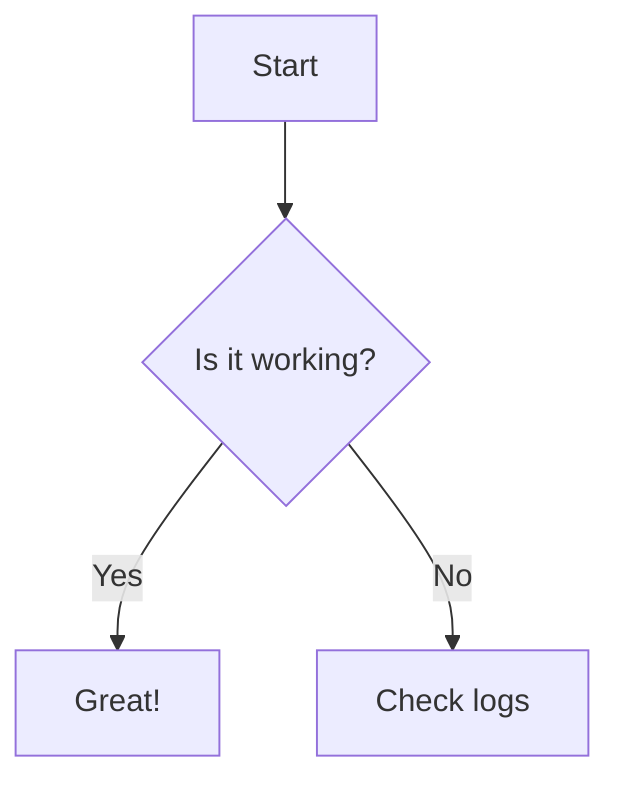

# Markdown Reference

MD-Site supports standard GitHub Flavored Markdown (GFM) along with several specialized extensions for a premium reading experience.

## 1. GFM Alerts

Use the following syntax:

```md
> [!NOTE]
> Valuable information that users should bear in mind even when skimming.

> [!TIP]
> Optional information to help a user be more successful.

> [!IMPORTANT]
> Crucial information necessary for users to succeed.

> [!WARNING]
> Critical content demanding immediate user attention due to potential risks.

> [!CAUTION]
> Negative potential consequences of an action.
```

These are rendered with distinct colors and icons (Info, Check, Primary, Warning, Error) based on our Material Design theme.

> [!NOTE]
> Valuable information that users should bear in mind even when skimming.

> [!TIP]
> Optional information to help a user be more successful.

> [!IMPORTANT]
> Crucial information necessary for users to succeed.

> [!WARNING]
> Critical content demanding immediate user attention due to potential risks.

> [!CAUTION]
> Negative potential consequences of an action.

## 2. Bible References

Any text matching common Bible reference patterns is automatically wrapped in a special span.

For example:

```md
This is an example that mention John 3:16 and Genesis 1:1-5.
```

Will be rendered as:

> This is an example that mention John 3:16 and Genesis 1:1-5.

> [!NOTE]
> You can hover or click on the bible references to see the verse content.

- **Visuals**: These references are highlighted with a distinct color.
- **Interactivity**: Hovering over a reference (if enabled) will display a tooltip with the verse content.

## 3. Blockquotes

Standard markdown blockquotes are rendered as beautiful Material Design Cards:

For example:

```md
> This is a blockquote. It will appear inside a styled card with a left border matching your primary/secondary theme color.
>> This is a nested blockquote.
```

Will be rendered as:

> This is a blockquote. It will appear inside a styled card with a left border matching your primary/secondary theme color.
>> This is a nested blockquote.

## 4. Tables of Contents

A Table of Contents is automatically generated for every page based on the `h2` and `h3` headings. You don't need to add anything to your markdown files to enable this.

## 5. Code Blocks

Code blocks support syntax highlighting and are rendered in a monospaced font with a subtle background.

````md
```typescript
// Example code block
const message = "Hello from Nuxt Content!"
console.log(message)
```
````

This will render as:

```typescript
// Example code block
const message = "Hello from Nuxt Content!"
console.log(message)
```

## 6. Tables with lists

Tables with lists are supported and will be rendered as beautiful Material Design Tables:

For example:

```md
| Plain text       | Line breaks                | List                                                                  |
| ---------------- | -------------------------- | --------------------------------------------------------------------- |
| Blah, blah, blah | Line 1<br/>Line2<br/>Line3 | <ul><li>List item 1</li><li>List item 2</li><li>List item 3</li></ul> |
```

Will be rendered as:

| Plain text       | Line breaks                | List                                                                  |
| ---------------- | -------------------------- | --------------------------------------------------------------------- |
| Blah, blah, blah | Line 1<br/>Line2<br/>Line3 | <ul><li>List item 1</li><li>List item 2</li><li>List item 3</li></ul> |

## 7. Images

Images are supported using standard Markdown syntax. You can reference local images by their relative path.

For example, to include the project logo:

```md

```

Will be rendered as:


## 8. Mermaid Diagrams

You can create diagrams using [Mermaid syntax](https://mermaid.js.org/ecosystem/tutorials.html):

````md

````

Will be rendered as:


This will be rendered as a beautiful interactive diagram.

